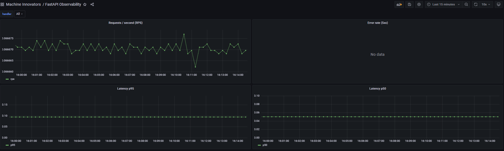
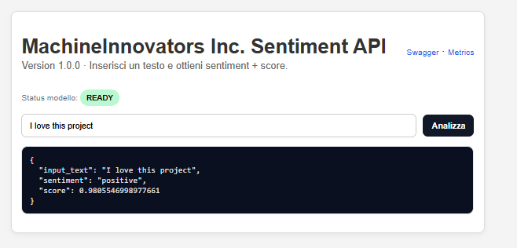

# 🚀 MachineInnovators Inc. - MLOps Sentiment Analysis Pipeline


## 📖 Descrizione del Progetto

Questa repository ospita l'implementazione end-to-end di una pipeline MLOps per **MachineInnovators Inc.** L'obiettivo primario è fornire un'infrastruttura di produzione scalabile, monitorabile e containerizzata per un modello di **Sentiment Analysis** basato su RoBERTa.

Il sistema è progettato seguendo l'architettura a microservizi, completamente orchestrato tramite Docker Compose, garantendo riproducibilità e facilità di deployment.

### ✨ Caratteristiche Principali
* **Serving ad Alte Prestazioni:** API REST costruita con Python e FastAPI.
* **Modello SOTA:** Utilizzo di HuggingFace Transformers (RoBERTa) per l'inferenza.
* **Containerizzazione Completa:** Ambiente isolato gestito con Docker e Docker Compose.
* **Observability Stack:** Monitoraggio in tempo reale con Prometheus (raccolta metriche) e Grafana (visualizzazione).
* **Automazione CI/CD:** Pipeline Github Actions per Linting (flake8) e Testing (pytest).
* **Orchestrazione MLOps:** Gestione del ciclo di riaddestramento tramite Apache Airflow.

---

## 🏗️ Architettura del Sistema

Il sistema è composto da 4 servizi interconnessi:

1.  **`innovators-api`**: Il cuore dell'applicazione. Espone il modello ML tramite endpoint REST e una semplice interfaccia di test.
2.  **`prometheus`**: Time-series database che effettua lo scraping delle metriche dall'endpoint `/metrics` dell'API.
3.  **`grafana`**: Dashboard visuale collegata a Prometheus per monitorare salute del sistema, latenza e traffico.
4.  **`airflow`**: Orchestratore di workflow per gestire la pipeline di retraining (Fetch Data -> Train -> Deploy).

---

## 🚀 Getting Started

### Prerequisiti
* Docker & Docker Compose installati sulla macchina.
* Git.

### Installazione e Avvio
L'intero ambiente si avvia con un singolo comando. Clona la repository e lancia la build:

```bash
git clone https://github.com/Nikuez95/machine-innovators-inc
cd machine-innovators-mlops

# Build e avvio dei container in background
docker-compose up -d --build
```

---

## 🔌 Accesso ai Servizi

Una volta avviato, i servizi sono accessibili ai seguenti indirizzi locali:

1. API & UI Test - **`http://localhost:8000`**
2. Grafana - **`http://localhost:3000`** / Username: admin / Password: admin
3. Prometheus - **`http://localhost:9090`**
4. Airflow - **`http://localhost:8080`** / Username: airflow / Password: airflow



---

## 💻 Esempi di Utilizzo

Test via Browser
Vai su **`http://localhost:8000`** per utilizzare l'interfaccia HTML semplificata per testare il sentiment di una frase.



Test via cURL
Puoi interrogare direttamente l'API dal terminale:
```bash
curl -X POST "http://localhost:8000/analyze" \
     -H "Content-Type: application/json" \
     -d '{"text": "L architettura MLOps di questo progetto è fantastica!"}'
```
Risposta attesa:
```json
{
  "sentiment": "positive",
  "score": 0.94
}
```
---

## 📊 Monitoraggio e Metriche
L'API è instrumentata con **`prometheus-fastapi-instrumentator`**. Accedendo a Grafana (**`localhost:3000`**), è possibile visualizzare la dashboard che traccia:

1. Traffico API: Richieste al secondo (RPS).
2. Latenza: Tempo di risposta medio e 95th percentile.
3. Tasso di Errore: Percentuale di risposte non-200.

---

## ⚙️ Sviluppo e CI/CD
La pipeline di Continuous Integration è definita in **`.github/workflows/CI-CD.yml`**. Ad ogni push sul branch **`main`**:
1. **Linting**: Controllo stile codice con flake8 (configurato in setup.cfg).
2. **Testing**: Esecuzione test unitari con pytest.
3. **Build**: *(Opzionale/Futuro)* Build e Push dell'immagine Docker.

Per eseguire i test in locale:
```bash
# Installa dipendenze dev
pip install -r requirements-dev.txt
# Esegui test
pytest
```
---

## 🔮 Roadmap e Sviluppi Futuri
Basato sui feedback ricevuti, le prossime iterazioni del progetto includeranno:

[ ] Interactive Demo: Aggiunta di un Notebook Google Colab per demo interattiva.

[ ] Training Reale: Implementazione script train.py completo con metriche di valutazione reali (F1, Accuracy) in sostituzione della simulazione attuale.

[ ] Security Hardening: Rimozione credenziali hardcoded (uso di .env) e configurazione user non-root nei Dockerfile.

[ ] Advanced Monitoring: Aggiunta metriche specifiche per ML (Drift detection, distribuzione confidenza).

[ ] Frontend Decoupling: Migrazione dell'interfaccia HTML inline verso una soluzione Streamlit o Jinja2 templates separati.


